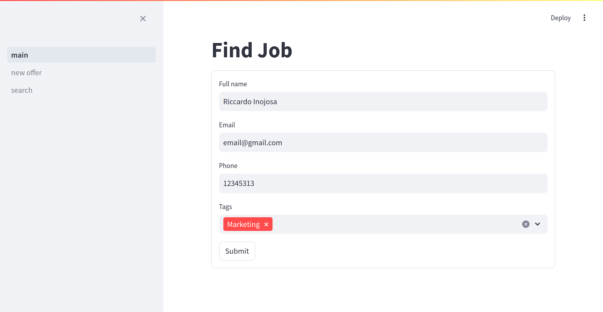
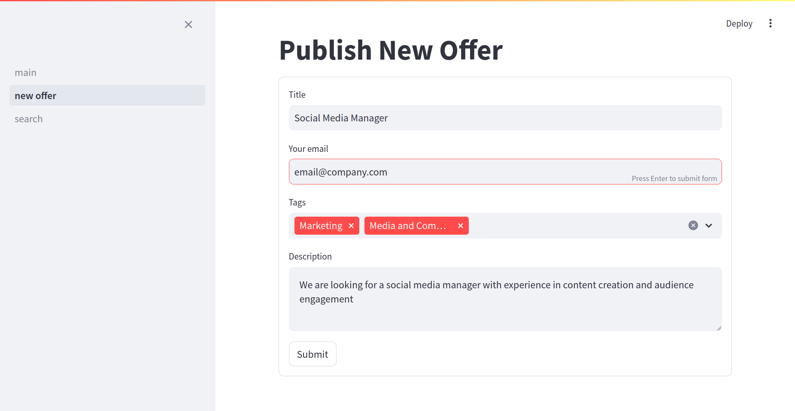

# Job Board
This Python script and Streamlit web app manage job seeker data efficiently. It integrates CSV for tag selection and JSON for storing seeker details. Users can input seeker information via a Streamlit form, selecting relevant tags from a CSV file (tags.csv). Upon submission, seeker details are stored in a JSON file (seekers.json), simplifying the process of managing and tracking job applicants.
 
First, there is the homepage where the job seeker must enter their personal information: name, email, phone number, and also the professional areas from which they would like to receive information whenever new offers are posted.
 

 
Additionally, there is a section to post a job offer, where the necessary information must be provided: job title, email of the person or company posting the offer, the professional areas involved in that job, and the job description.
 
 

 
Once the offer is published, it will be stored in a JSON file, and users who registered to seek employment and have matching professional areas with the offer will receive an email with the offer's information.
 
 

 
There is also a section to search for offers by category.
 
 

